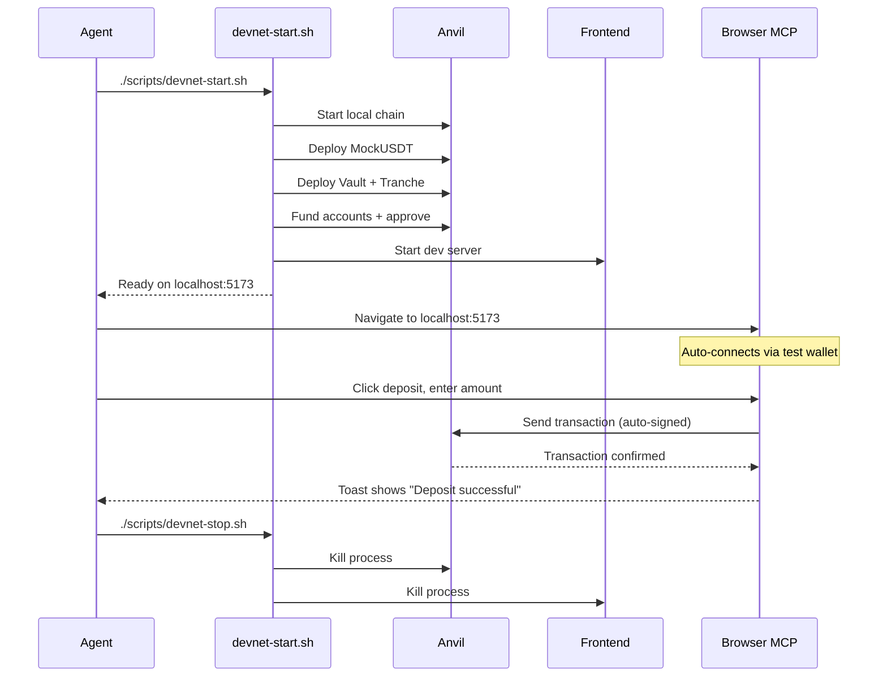

# Sprint 2 Handoff Document

## Summary

Sprint 2 focused on improving the developer experience and filling functionality gaps identified in Sprint 1. The major accomplishments were upgrading to ERC721Enumerable for token enumeration, adding past tranches display, implementing toast notifications for transaction feedback, and improving documentation.

---

## What Went Right

### Smart Contracts
- **Clean ERC721Enumerable Upgrade**: Minimal changes required - just import, inheritance change, and `supportsInterface` override
- **All Tests Pass**: 26 tests (21 DonationTranche + 5 DonationMatchVault) pass including new enumeration test
- **Backward Compatible**: Existing functionality unchanged, only new features added

### Frontend
- **Note Enumeration Working**: `MyNotes.tsx` now displays individual note cards with full details
- **Past Tranches Visible**: Expandable accordion UI shows historical tranche data
- **Toast Notifications**: Sonner library integrated with dark theme matching app design
- **Demo Data Alert**: Clear warning banner when contract not deployed
- **TypeScript Clean**: All builds pass with no type errors

### Documentation
- **README Enhanced**: Now includes env vars, testing instructions, deployment checklist, known issues
- **Cross-Linking**: PROPOSAL.md and SPRINT2.md now discoverable from main README

---

## What Went Wrong

### Technical Issues

1. **ABI Type Incomplete**: The `DonationTrancheABI` was missing `stateMutability` on constructor, causing TypeScript errors when using `useReadContracts`. Fixed by adding the field.

2. **No Visual Verification**: Changes were verified by build success but not visually tested. No E2E tests exist to confirm UI rendering.

3. **Shell State Confusion**: The shell retained CWD from previous commands, causing a brief failure. Always use `working_directory` parameter.

### Missing Coverage

4. **No Integration Tests**: Frontend changes have no test coverage - rely entirely on TypeScript compilation.

5. **No Error Boundaries**: If a contract call fails unexpectedly, the entire component may crash.

---

## Gaps Remaining

| Gap | Description | Effort | Priority |
|-----|-------------|--------|----------|
| Devnet Scripts | One-command local dev setup with Anvil | 4 hours | **P1** |
| E2E Browser Tests | Automated testing via browser with test wallet | 8 hours | **P1** |
| Frontend Unit Tests | React component tests with Vitest | 4 hours | P2 |
| Contract Verification | Auto-verify on BSCScan after deploy | 1 hour | P2 |
| Note Transfer UI | Allow users to transfer notes | 2 hours | P3 |
| Token URI/Metadata | Add NFT metadata for wallets/marketplaces | 4 hours | P3 |
| Error Boundaries | Graceful error handling at app level | 2 hours | P3 |
| Mobile Testing | Verify responsive design on devices | 2 hours | P3 |
| Admin Dashboard | UI for scheduling tranches, setting APR | 6 hours | P4 |

---

## File Changes in Sprint 2

### Smart Contracts

```
smartcontracts/src/DonationTranche.sol
├── Added: import ERC721Enumerable (line 5)
├── Changed: inherits ERC721Enumerable instead of ERC721 (line 15)
└── Added: supportsInterface override (lines 434-438)

smartcontracts/test/DonationTranche.t.sol
└── Added: test_TokenEnumeration() (lines 438-462)

smartcontracts/script/Deploy.s.sol
└── Enhanced: post-deployment instructions with specific commands (lines 38-56)
```

### Frontend

```
frontend/src/features/MyNotes.tsx
├── Complete rewrite
├── Added: NoteCard component with detailed note display
├── Added: useReadContracts for batch token fetching
└── Added: Token enumeration via tokenOfOwnerByIndex

frontend/src/features/PastTranches.tsx (NEW)
├── PastTrancheCard component with expandable accordion
├── Fetches all tranches from 1 to currentTrancheId-1
└── Displays dates, fill rate, collection status

frontend/src/features/DepositModal.tsx
├── Added: toast import from sonner
├── Added: useEffect hooks for transaction status toasts
└── Added: Error state handling with toast.error

frontend/src/main.tsx
└── Added: Toaster component with dark theme

frontend/src/App.tsx
├── Added: PastTranches import and component
└── Added: Demo data alert banner

frontend/src/lib/abi/DonationTranche.ts
├── Fixed: Added stateMutability to constructor
└── Added: ERC721Enumerable functions (totalSupply, tokenByIndex, tokenOfOwnerByIndex)
```

### Documentation

```
README.md
├── Added: Documentation section with links
├── Added: Environment Variables table
├── Added: Testing section
├── Added: Full deployment checklist
└── Added: Known Issues section
```

---

## Testing Commands

```bash
# Smart Contracts
cd smartcontracts
forge test -vv                          # Run all 26 tests
forge test --match-test Enumeration -vv # Run enumeration test only
forge coverage                          # Coverage report

# Frontend
cd frontend
npm run dev                             # Development server
npm run build                           # Production build (includes TypeScript check)
npm run preview                         # Preview production build
```

---

## Recommendations for Sprint 3

### Priority 1: Devnet Testing Infrastructure

The biggest gap is the inability to test the full stack automatically. Implement:

#### 1. Create `scripts/devnet-start.sh`

```bash
#!/bin/bash
set -e

# Start Anvil in background
anvil --block-time 1 &
ANVIL_PID=$!
echo "Anvil started (PID: $ANVIL_PID)"
sleep 2

# Deploy contracts
cd smartcontracts
PRIVATE_KEY=0xac0974bec39a17e36ba4a6b4d238ff944bacb478cbed5efcae784d7bf4f2ff80 \
  forge script script/DeployLocal.s.sol --rpc-url http://localhost:8545 --broadcast

# Start frontend
cd ../frontend
VITE_TEST_MODE=true npm run dev &

echo "=== Devnet Ready ==="
echo "Anvil: http://localhost:8545"
echo "Frontend: http://localhost:5173"
echo "Test wallet: 0xf39Fd6e51aad88F6F4ce6aB8827279cffFb92266"
```

#### 2. Create `scripts/DeployLocal.s.sol`

A deployment script that:
- Deploys a mock USDT
- Mints USDT to test accounts
- Deploys vault and tranche
- Funds vault and approves tranche
- Starts first tranche
- All ready to test immediately

#### 3. Create Test Wallet Provider

Add a burner wallet mode for the frontend:

```typescript
// frontend/src/providers/TestWalletProvider.tsx
// Anvil account[0] - NEVER use on mainnet
const TEST_PRIVATE_KEY = '0xac0974bec39a17e36ba4a6b4d238ff944bacb478cbed5efcae784d7bf4f2ff80';
```

When `VITE_TEST_MODE=true`:
- Auto-connect with test wallet (no extension needed)
- Transactions auto-sign (no popups)
- Browser MCP can fully test the flow

#### 4. Browser Test Flow

With the above, an agent can:
1. Run `./scripts/devnet-start.sh`
2. Use browser MCP to navigate to localhost:5173
3. The app auto-connects (no wallet popup)
4. Interact with deposit flow
5. Verify success via DOM assertions
6. Run `./scripts/devnet-stop.sh`

### Priority 2: Add Mock USDT for Local Testing

Create `smartcontracts/src/mocks/MockUSDT.sol`:

```solidity
contract MockUSDT is ERC20 {
    constructor() ERC20("Mock USDT", "USDT") {
        _mint(msg.sender, 1_000_000 ether);
    }
    
    function mint(address to, uint256 amount) external {
        _mint(to, amount);
    }
}
```

This already exists in the test file but should be extracted for deployment scripts.

### Priority 3: Contract Verification

Add to `Deploy.s.sol`:

```bash
# After deployment, verify:
forge verify-contract <ADDRESS> DonationTranche \
  --chain bsc \
  --etherscan-api-key $BSCSCAN_API_KEY \
  --constructor-args $(cast abi-encode "constructor(address,address,address,address)" ...)
```

---

## Architecture: Devnet Testing Flow



---

## Known Issues (Unchanged from Sprint 1)

1. **Matching Requires Pre-Approval**: Vault must approve tranche before deposits. Deploy script now prints exact command.

2. **USDT Decimals**: Code assumes 18 decimals (BSC standard). Documented in README.

3. **No Rate Limiting**: Filling entire tranche in one tx is allowed by design. Documented.

---

## Key Addresses (BSC Mainnet)

| Role | Address |
|------|---------|
| AccessManager | `0x5823a01A5372B779cB091e47DBBb176F2831b4c7` |
| Cluster Manager | `0x30789c78b7640947db349e319991aaec416eeb93` |
| Vault Owner (Multisig) | `0x745A676C5c472b50B50e18D4b59e9AeEEc597046` |
| USDT (BSC) | `0x55d398326f99059fF775485246999027B3197955` |

---

## Key Addresses (Anvil Local Testing)

| Role | Address | Private Key |
|------|---------|-------------|
| Deployer/Admin | `0xf39Fd6e51aad88F6F4ce6aB8827279cffFb92266` | `0xac0974bec39a17e36ba4a6b4d238ff944bacb478cbed5efcae784d7bf4f2ff80` |
| Test User 1 | `0x70997970C51812dc3A010C7d01b50e0d17dc79C8` | `0x59c6995e998f97a5a0044966f0945389dc9e86dae88c7a8412f4603b6b78690d` |
| Test User 2 | `0x3C44CdDdB6a900fa2b585dd299e03d12FA4293BC` | `0x5de4111afa1a4b94908f83103eb1f1706367c2e68ca870fc3fb9a804cdab365a` |

These are Anvil's default accounts - safe to commit, never use on mainnet.

---

## Sprint 2 Metrics

| Metric | Value |
|--------|-------|
| Smart Contract Tests | 26 passing |
| New Tests Added | 1 (TokenEnumeration) |
| Frontend Build Size | 472 KB gzipped |
| New Components | 2 (PastTranches, NoteCard) |
| Dependencies Added | 1 (sonner) |
| Lines Changed | ~400 |

---

*Sprint 2 completed. Ready for devnet testing infrastructure and E2E test implementation.*
