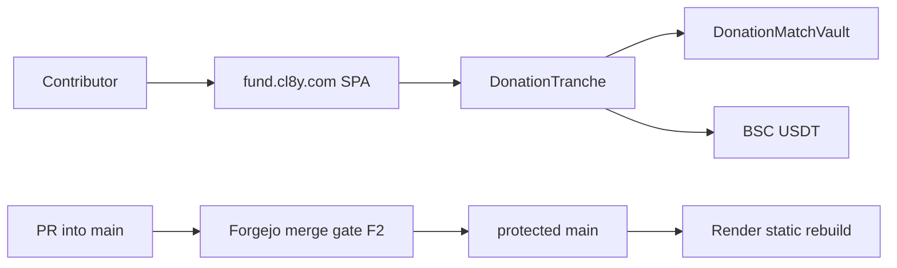
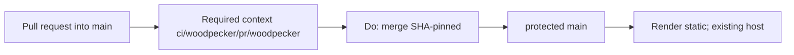

# Architecture overview

`code/cl8y-aidevclusterfund` is **CL8Y Fund**: invite-only USDT fundraising for AI
dev-cluster inference, with NFT donation notes and 1:1 CZodiac vault matching.
Live site: `fund.cl8y.com`.

Product and economic design stays in [`PROPOSAL.md`](../PROPOSAL.md). This file
is the **merge gate** only. Sprint notes and contract audit notes stay in
`SPRINT*.md` and [`smartcontracts/AUDIT.md`](../smartcontracts/AUDIT.md). Do
not copy those here. Do not treat this file as a second product architecture.

Catch-all `CODEOWNERS` removal is decided in
[ADR 0001](adr/0001-remove-catchall-codeowners.md)
([#2](https://git.cl8y.com/code/cl8y-aidevclusterfund/issues/2)); do not
duplicate that narrative. Vehicle **B** copies this file and ADR 0001 as-is
onto the product PR so `main` holds the standing contract.

## Runtime

| Layer | Choice |
|-------|--------|
| App | Vite + React SPA in `frontend/` (wagmi/viem). No SSR. |
| Host | Render static (`frontend/render.yaml`). Clickjacking: `X-Frame-Options: DENY`. |
| Contracts | Foundry: `DonationTranche` (UUPS) + `DonationMatchVault` on BSC. |
| Access | Existing `AccessManager` + CZodiac multisig. Not this ticket. |
| Local lab | `scripts/devnet-*.sh` Anvil + Vite. Not a merge gate. |



Vendored `smartcontracts/lib/**` (OpenZeppelin, forge-std) is third-party. Their
`.github/CODEOWNERS` files are **not** Forgejo owner documents.

## Forgejo merge gate {#forgejo-merge-gate}

Official CODEOWNERS review is **not** a merge gate. Decision, slices, tests,
rollback: [ADR 0001](adr/0001-remove-catchall-codeowners.md). Host write-up:
[cl8y-forgejo#48](https://git.cl8y.com/PlasticDigits/cl8y-forgejo/issues/48)
and forgejo PR **#50** (`docs/INVARIANTS.md` + ADR 0003 item 8). A 404 on
forgejo `main` for that file does not mean the policy is missing. Deploy /
spend / custody / policy expansion:
[agent-control #297](https://git.cl8y.com/PlasticDigits/cl8y-agent-control/issues/297)
— this ticket is none of those. Sister CAC autoland predicates are
[#429](https://git.cl8y.com/PlasticDigits/cl8y-agent-control/issues/429), not
this fund repo. [hello#15](https://git.cl8y.com/code/hello/pulls/15) is the
fleet canary, not a local iid.

### Merge gate (F2)

Three contract groups. Operator
`GET /api/v1/repos/code/cl8y-aidevclusterfund/branch_protections` must equal the
**protection** rows only. That list endpoint returns an **array**; pick
`rule_name == "main"` (or
`GET /api/v1/repos/code/cl8y-aidevclusterfund/branch_protections/main`).
Unauthenticated GET is 401. A green scanner, a Render rebuild, or a GET on a
different `code/*` repo is **not** proof of **F2-2**, **F2-8**, **F2-3**,
**F2-9**, **F2-10**, or **F2-5**. Fleet values recorded for #48 / `code/hello`
are not proof for this repo. This tree has **no** dated protection JSON for
`code/cl8y-aidevclusterfund`.

#### Protection GET (six flags)

| ID | Flag | Required value |
| --- | --- | --- |
| **F2-2** | `enable_push` | `false` (no direct push to `main`) |
| **F2-8** | `enable_status_check` | `true` |
| **F2-3** | `status_check_contexts` | `["ci/woodpecker/pr/woodpecker"]` (array **equal**, not subset) |
| **F2-9** | `required_approvals` | `0` |
| **F2-10** | `block_on_official_review_requests` | `false` |
| **F2-5** | `block_on_rejected_reviews` | `true` |

GET equality is these six rows for the `main` rule. Merge procedure is not a
protection field.

**F2-2** is `enable_push == false` only. It does **not** mean “no force-push.”
Force-push allowlist fields (if the host exposes them) and `apply_to_admins`
are other keys; they stay [cl8y-forgejo#48](https://git.cl8y.com/PlasticDigits/cl8y-forgejo/issues/48),
not this ticket.

A leftover official CODEOWNERS request on an open PR (including
[#2](https://git.cl8y.com/code/cl8y-aidevclusterfund/pulls/2)) is non-blocking
**only if** a dated GET of **this** repo’s `main` rule shows **F2-9** and
**F2-10**. Post that JSON as a comment on product PR `#2` or on the leftover
issue, before merge. Unauthenticated GET is 401; a VM log is not the artifact.
If `block_on_official_review_requests` is still `true` here, merge is 405. Do
not infer those two flags from fleet #48. Plant-check matchers are split by
endpoint in [ADR 0001](adr/0001-remove-catchall-codeowners.md) (do not require
org on reviews `team.organization`).

This tree had **no** `.woodpecker.yaml` / `.woodpecker/` on `main` when #2 was
filed; commit `ec4ddcf` had **no** commit statuses. Host may still require
`ci/woodpecker/pr/woodpecker`. Adding a pipeline is **not** ADR 0001. Missing
statuses are a pre-existing host/CI gap, not a reason to keep catch-all
CODEOWNERS, fake a context, or `force_merge`. When **F2-8** is true, `Do:
merge` of `#2` still requires green `ci/woodpecker/pr/woodpecker` on that
SHA (ADR 0001 Integration completion).

#### Merge procedure

| ID | Rule |
| --- | --- |
| **F2-4** | SHA-pinned `Do: merge` with `head_commit_id`. Never document or use `force_merge`. |

#### Tree contracts

| ID | Rule |
| --- | --- |
| **F2-1** | `test -f` fails on `CODEOWNERS`, `docs/CODEOWNERS`, `.gitea/CODEOWNERS`, and `.forgejo/CODEOWNERS`. Vendored `smartcontracts/lib/**/.github/CODEOWNERS` are out of this ID. |
| **F2-6** | Render stays `main`-follow via existing `frontend/render.yaml`. This ticket does not add PR preview deploys, change headers, or treat a Render rebuild as leftover-complete. |
| **F2-7** | This tree does not expand CAC merge/deploy/spend/custody policy. |

Forgejo loads the first existing file among `CODEOWNERS`, `docs/CODEOWNERS`,
`.gitea/CODEOWNERS`, and `.forgejo/CODEOWNERS` (Go-regexp, not GitHub globs;
`.forgejo/` added in forgejo#8773; `.gitea/` remains in the walk). After
ADR 0001, **F2-1** holds. None of those four paths may contain a reviewer rule
for any pattern (ADR 0001 Decision 2). Do not leave an empty or comments-only
file; Forgejo still parses it.



Local husky (`gitleaks`, frontend `tsc` + vitest) is a contributor hook, not
**F2-3**.

This tree does not change Forgejo protection JSON, CAC autoland predicates, or
Render app config. Those remain
[cl8y-forgejo#48](https://git.cl8y.com/PlasticDigits/cl8y-forgejo/issues/48),
[cl8y-agent-control#429](https://git.cl8y.com/PlasticDigits/cl8y-agent-control/issues/429),
and [agent-control #297](https://git.cl8y.com/PlasticDigits/cl8y-agent-control/issues/297)
respectively.

## Directory (agents)

```
frontend/            SPA + vitest/playwright + render.yaml
smartcontracts/      Foundry sources, tests, AUDIT.md
smartcontracts/lib/  vendored; do not treat as Forgejo CODEOWNERS
scripts/             Anvil devnet helpers
docs/adr/            versioned decisions
docs/architecture.md this file (merge gate F2 only)
PROPOSAL.md          product/economic design
```

## ADRs

| ADR | Topic |
|-----|--------|
| [0001](adr/0001-remove-catchall-codeowners.md) | Remove catch-all CODEOWNERS ([#2](https://git.cl8y.com/code/cl8y-aidevclusterfund/issues/2)) |
